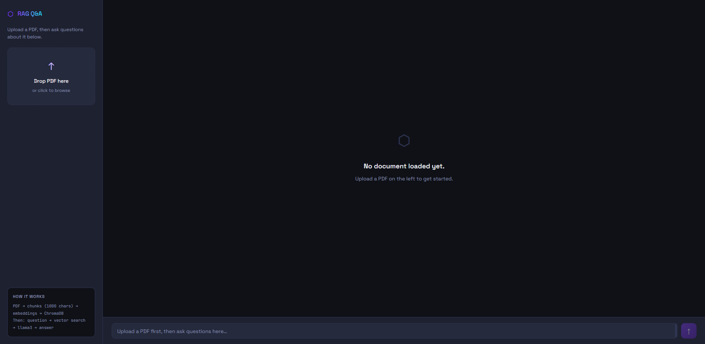
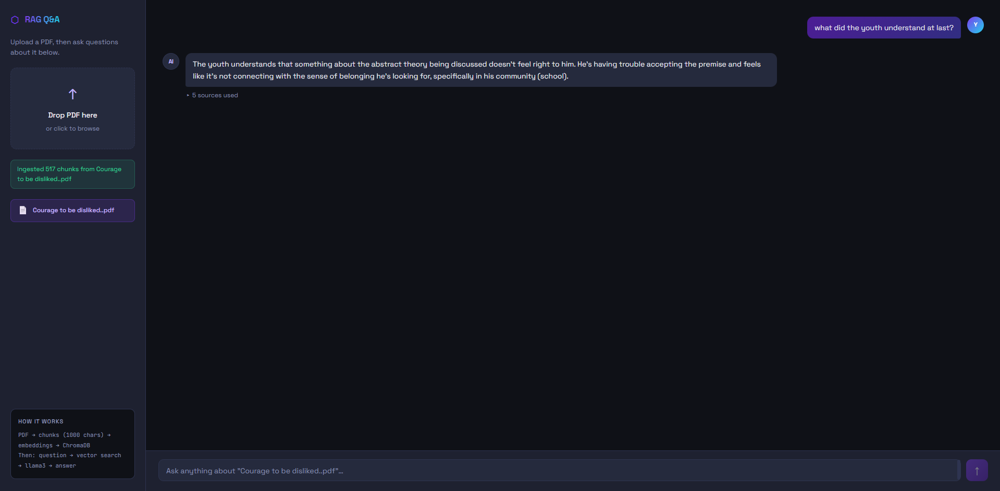
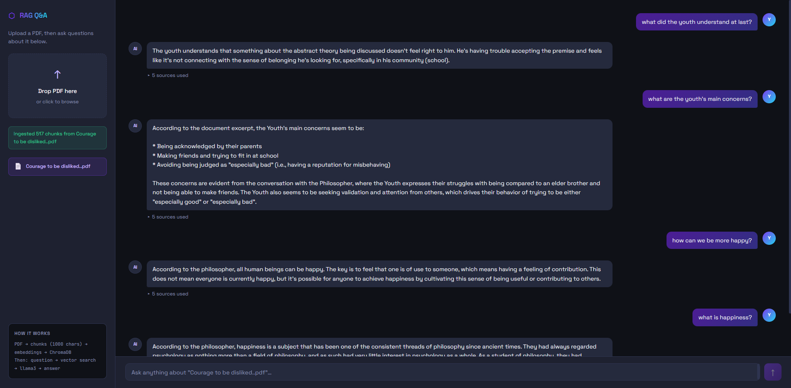
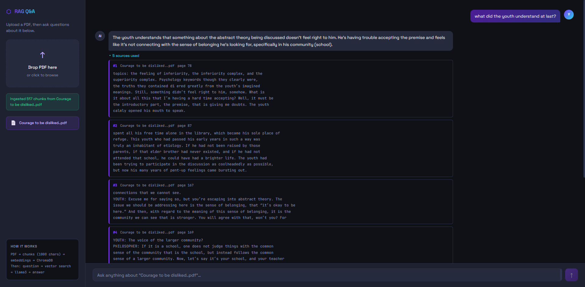

# RAG Document Q&A

A fully local Retrieval-Augmented Generation (RAG) system with a web UI. Upload a PDF, ask questions, and get answers grounded in your document — with source citations showing exactly which chunks were used.

Built with **React**, **FastAPI**, **LangChain**, **ChromaDB**, and **Ollama**. Runs entirely in Docker. No cloud APIs, no API keys.

---

## Screenshots

<!-- SCREENSHOT: Main UI — upload panel on the left, empty chat on the right, dark theme -->
<!-- Save as: docs/screenshots/01-main-ui.png -->


<!-- SCREENSHOT: PDF successfully ingested — green success message and filename badge visible -->
<!-- Save as: docs/screenshots/02-upload-success.png -->


<!-- SCREENSHOT: Chat with a question and AI answer, "sources used" collapsed -->
<!-- Save as: docs/screenshots/03-chat-answer.png -->


<!-- SCREENSHOT: Expanded "sources used" panel showing chunk text and page numbers -->
<!-- Save as: docs/screenshots/04-sources-expanded.png -->


---

## What problem does this solve?

LLMs like llama3 have two core limitations:

- **Hallucination** — they generate confident but incorrect answers
- **Knowledge cutoff** — they don't know about your private documents

RAG solves both by retrieving relevant chunks from your PDF *before* the LLM generates an answer. The model is instructed to answer from that context, and you can inspect the exact source chunks used.

---

## Features

- **Web UI** — drag-and-drop PDF upload and chat interface at `http://localhost:3000`
- **Per-document isolation** — each upload replaces the previous one; questions are scoped to the active PDF only
- **Source citations** — expand "sources used" to see the retrieved chunks and page numbers
- **Fully local** — embeddings (`all-MiniLM-L6-v2`) and LLM (`llama3` via Ollama) run on your machine
- **Docker Compose** — one command starts frontend, API, ChromaDB, and Ollama
- **REST API** — `/ingest` and `/ask` endpoints for programmatic use

---

## Architecture

```
INGEST FLOW (once per upload)
Browser → nginx (3000) → FastAPI /ingest → PDF → chunks (1000 chars, 200 overlap)
         → embed (all-MiniLM-L6-v2) → ChromaDB (clears previous doc)

QUERY FLOW (every question)
Browser → nginx (3000) → FastAPI /ask → embed question → vector search (top 5, filtered by filename)
         → prompt + llama3 → answer + source documents
```

```
┌─────────────┐     ┌─────────────┐     ┌─────────────┐
│  Frontend   │────▶│  FastAPI    │────▶│  ChromaDB   │
│  React+Nginx│     │  app :8080  │     │  :8000      │
│  :3000      │     └──────┬──────┘     └─────────────┘
└─────────────┘            │
                           ▼
                    ┌─────────────┐
                    │   Ollama    │
                    │  llama3     │
                    │  :11434     │
                    └─────────────┘
```

---

## Tech stack

| Layer | Technology | Role |
|---|---|---|
| Frontend | React + Vite | Upload UI and chat |
| Reverse proxy | nginx | Serves static files, proxies `/ingest` and `/ask` to FastAPI |
| API | FastAPI | Ingest and query endpoints |
| RAG | LangChain `RetrievalQA` | Retrieval + LLM chain |
| Vector store | ChromaDB | Similarity search over document chunks |
| Embeddings | `all-MiniLM-L6-v2` | Local sentence embeddings |
| LLM | llama3 via Ollama | Local text generation |
| Containers | Docker Compose | Multi-service orchestration |

---

## Prerequisites

- [Docker Desktop](https://www.docker.com/products/docker-desktop/) (Windows, macOS, or Linux)
- ~8 GB free disk space (llama3 model is ~4 GB)
- Enough RAM for Ollama + embeddings (8 GB+ recommended)

---

## Quick start

```bash
git clone https://github.com/ShashiShukla-001/rag-doc-qa.git
cd rag-doc-qa
docker compose up --build
```

Pull the LLM model (one-time, ~4 GB):

```bash
docker exec -it rag-doc-qa-ollama-1 ollama pull llama3
```

Open the app:

| URL | Purpose |
|---|---|
| http://localhost:3000 | Web UI (upload + chat) |
| http://localhost:8080/docs | FastAPI interactive API docs |

**Usage:** upload a PDF on the left, then ask questions in the chat on the right.

---

## API usage

### Ingest a PDF

```bash
curl -X POST http://localhost:8080/ingest \
  -F "file=@your_document.pdf"
```

Response:

```json
{ "message": "Ingested 47 chunks from your_document.pdf" }
```

### Ask a question

```bash
curl -X POST http://localhost:8080/ask \
  -H "Content-Type: application/json" \
  -d '{"question": "What is the main topic?", "filename": "your_document.pdf"}'
```

Response:

```json
{
  "answer": "...",
  "sources": [
    {
      "metadata": { "filename": "your_document.pdf", "page": 2 },
      "page_content": "..."
    }
  ]
}
```

> `filename` must match the uploaded PDF name. The web UI sends this automatically.

---

## Services

| Service | Port | Purpose |
|---|---|---|
| Frontend (nginx) | 3000 | Web UI + API proxy |
| FastAPI app | 8080 | REST API |
| ChromaDB | 8000 | Vector storage |
| Ollama | 11434 | Local LLM runtime |

---

## Project structure

```
rag-doc-qa/
├── docker-compose.yml
├── app/
│   ├── Dockerfile
│   ├── requirements.txt
│   ├── main.py           # FastAPI endpoints
│   ├── ingest.py         # PDF → chunks → ChromaDB
│   ├── rag_chain.py      # Retrieval + LLM prompt chain
│   └── vectorstore.py    # Shared ChromaDB client
├── frontend/
│   ├── Dockerfile
│   ├── nginx.conf        # Proxies /ingest and /ask to app
│   └── src/
│       ├── App.jsx
│       └── components/   # UploadPanel, ChatPanel, ChatMessage
└── docs/
    └── screenshots/      # README screenshots go here
```

---

## What I learned

- **RAG architecture** — separate ingest and query flows, and why retrieval must happen before generation
- **Vector embeddings** — similarity search over meaning, not keywords
- **Document isolation** — filtering ChromaDB by filename and clearing stale chunks on re-upload
- **Docker networking** — containers talk via service names (`app`, `chromadb`, `ollama`)
- **Production frontend** — Vite build served by nginx with API reverse proxy
