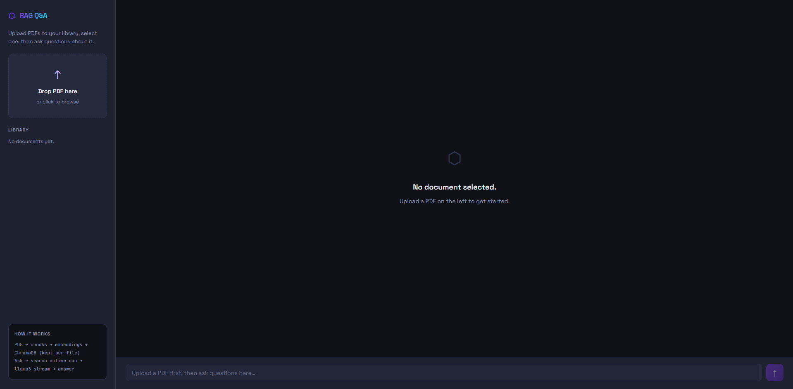
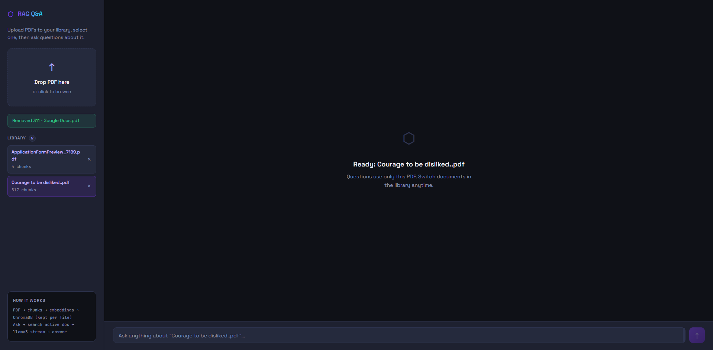
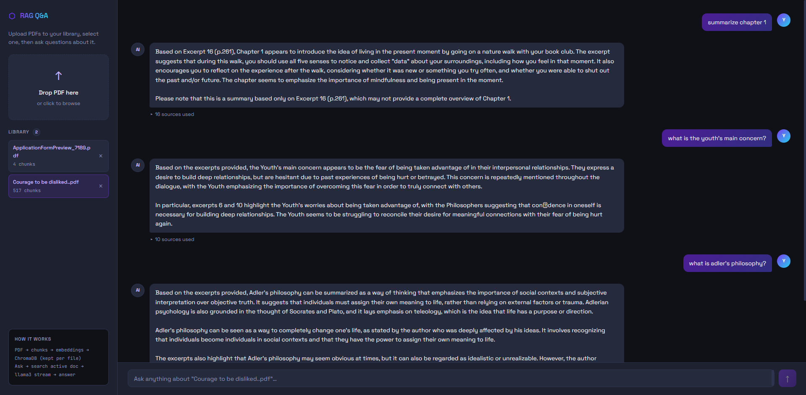
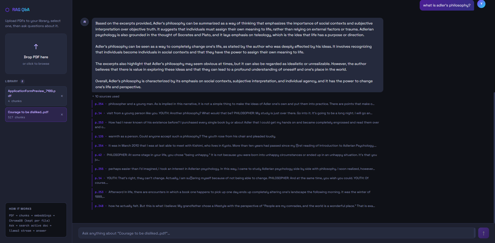
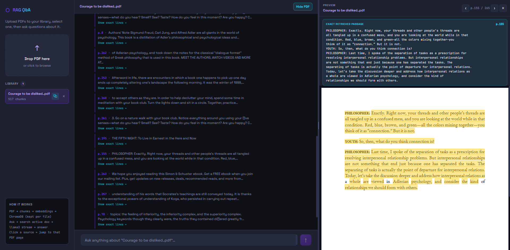
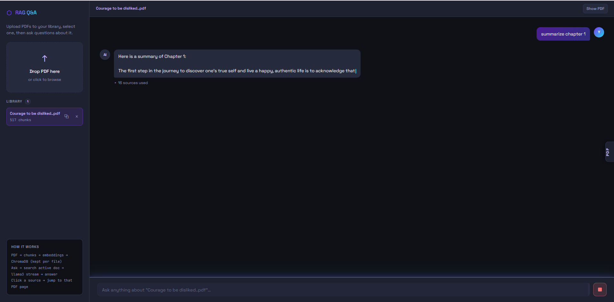
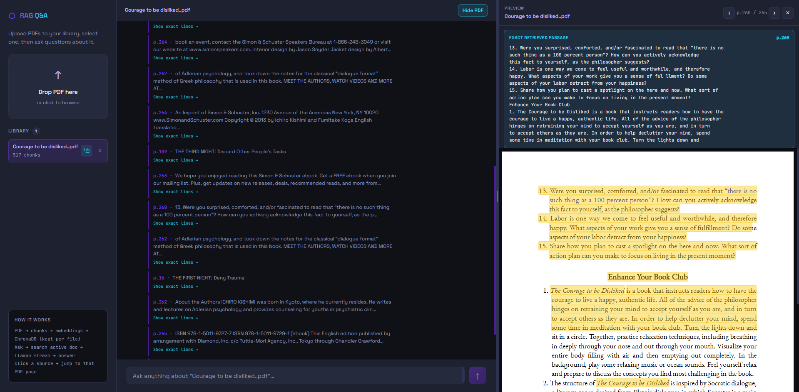

# RAG Document Q&A

A fully local Retrieval-Augmented Generation (RAG) system with a web UI. Upload multiple PDFs into a document library, select one, ask questions, and get **streamed** answers grounded in that document — with source citations, an in-app PDF preview, and a stop button for in-flight generation.

Built with **React**, **FastAPI**, **LangChain**, **ChromaDB**, and **Ollama**. Runs entirely in Docker. No cloud APIs, no API keys.

---

## Screenshots

<!-- SCREENSHOT: Library + upload left, empty chat right, optional PDF tab on the edge -->


<!-- SCREENSHOT: Several PDFs in Library; one selected (chunk count visible) -->


<!-- SCREENSHOT: Chat with a completed answer; sources collapsed; Show PDF in toolbar -->


<!-- SCREENSHOT: Expanded sources with “Show exact lines →” on each citation -->


<!-- SCREENSHOT: PDF pane open — exact retrieved passage + highlighted page; resize handle visible -->


<!-- SCREENSHOT: Mid-stream — red stop button in the input row (instead of send) -->


<!-- SCREENSHOT: PDF pane resized wide, or edge “PDF” tab when preview is hidden -->


### Screenshot checklist

| File | What to show |
|---|---|
| `01-main-ui.png` | Fresh UI: library + drop zone + empty chat |
| `02-library.png` | 2+ PDFs in Library, one active |
| `03-chat-answer.png` | Answer + “N sources used” (collapsed) |
| `04-sources-expanded.png` | Sources open with page labels / “Show exact lines” |
| `05-pdf-preview.png` | Preview open: exact passage box + PDF page |
| `06-stop-generation.png` | Generating state with **stop** button |
| `07-pdf-pane-toggle.png` | Drag handle / “Show PDF” / edge **PDF** tab |

---

## What problem does this solve?

LLMs like llama3 have two core limitations:

- **Hallucination** — they generate confident but incorrect answers
- **Knowledge cutoff** — they don't know about your private documents

RAG solves both by retrieving relevant chunks from your PDF *before* the LLM generates an answer. The model is instructed to answer from that context, and you can inspect the exact source chunks — and jump into the PDF at those lines.

---

## Features

- **Web UI** — drag-and-drop PDF upload and chat at `http://localhost:3000`
- **Multi-document library** — keep several PDFs; switch, re-upload (replace one), or delete
- **Per-document chat history** — each PDF keeps its own conversation in the UI
- **Scoped retrieval** — every question searches only the selected document’s chunks
- **Streaming answers** — tokens appear as llama3 generates (SSE on `/ask`)
- **Stop generation** — cancel an in-flight answer with the stop button (`AbortController`)
- **Sticky scroll** — auto-follow only while near the bottom; scroll up freely mid-stream
- **Hybrid retrieval** — vector search + BM25, fused with Reciprocal Rank Fusion (RRF)
- **Chapter-aware answers** — “summarize the first chapter / chapter 2” expands to that chapter’s body
- **Chapter-aware chunking** — ingest prefers splits on `Chapter` / `CHAPTER` headings
- **PDF preview** — `react-pdf` pane with exact retrieved passage + text-layer highlights
- **Clickable citations** — expand sources → “Show exact lines →” jumps to that page/passage
- **Toggleable / resizable PDF pane** — Show/Hide PDF, edge tab, drag divider (width saved in `localStorage`)
- **Intent-aware prompting** — summaries must be multi-sentence; incomplete context is called out
- **Persistent vectors** — ChromaDB survives restarts (`chromadb_data` volume)
- **Fully local** — embeddings `all-MiniLM-L6-v2`, LLM `llama3` via Ollama
- **Docker Compose** — frontend, API, ChromaDB, Ollama
- **REST API** — `/ingest`, `/documents`, `/documents/{file}/file`, `/ask`

---

## Architecture

```
INGEST FLOW (per upload)
Browser → nginx (3000) → FastAPI /ingest → PDF
         → chunks (1000 chars, 200 overlap; prefer Chapter/CHAPTER splits)
         → embed (all-MiniLM-L6-v2) → ChromaDB
         (same filename: replace that doc only; other docs untouched)

LIBRARY / FILES
GET    /documents              → list filenames + chunk counts
GET    /documents/{name}/file  → serve PDF for preview (react-pdf)
DELETE /documents/{name}       → remove chunks + file on disk

QUERY FLOW (every question)
Browser → nginx (3000) → FastAPI /ask
         → hybrid retrieve (vector + BM25 → RRF; chapter expansion when asked)
         → prompt (answer the user’s intent) + llama3
         → SSE stream (sources → tokens → done)
         → client may AbortController-cancel (Stop button)
```

```
┌─────────────┐     ┌─────────────┐     ┌─────────────┐
│  Frontend   │────▶│  FastAPI    │────▶│  ChromaDB   │
│  React+Nginx│     │  app :8080  │     │  :8000      │
│  :3000      │     └──────┬──────┘     │  (persisted)│
└─────────────┘            │            └─────────────┘
                           ▼
                    ┌─────────────┐
                    │   Ollama    │
                    │  llama3     │
                    │  :11434     │
                    └─────────────┘
```

### How retrieval works

1. **Vector search** — embed the question; find semantically similar chunks in the active PDF  
2. **BM25** — keyword search over that PDF’s chunks (titles, names, “Chapter 1”)  
3. **RRF fusion** — merge the two ranked lists  
4. **Chapter expansion** — for chapter-style questions, find a `Chapter N` heading and pull consecutive chunks until the next chapter (or a size cap)  
5. **Higher `k` for summaries / chapters** — more context for those asks  

Chapter detection works best when the PDF text contains headings like `Chapter 1` or `CHAPTER 2`.

### How the prompt behaves

- Fully answer the user’s intent (summaries = multi-sentence, not just a title)  
- Prefer concrete points from the excerpts  
- If excerpts are incomplete, say what’s missing  
- Stay grounded in the uploaded PDF  

### PDF preview notes

- Preview uses **PDF.js** via `react-pdf` (not a plain iframe)  
- nginx must serve `.mjs` workers as `application/javascript` (configured in `frontend/nginx.conf`)  
- Scanned image-only PDFs may highlight poorly; the **Exact retrieved passage** box still shows the indexed text  

---

## Tech stack

| Layer | Technology | Role |
|---|---|---|
| Frontend | React + Vite | Library, chat, stop control, sticky scroll |
| PDF UI | `react-pdf` / PDF.js | Page render + text-layer highlight |
| Reverse proxy | nginx | Static files; proxies API; correct `.mjs` MIME |
| API | FastAPI | Ingest, library, PDF file serve, streaming Q&A |
| RAG | LangChain + Ollama `astream` | Hybrid retrieve, then stream tokens |
| Vector store | ChromaDB | Similarity search; filter by `filename` |
| Keyword search | BM25 (`rank_bm25`) | Exact terms the embedder may miss |
| Embeddings | `all-MiniLM-L6-v2` | Local sentence embeddings |
| LLM | llama3 via Ollama | Local text generation |
| Containers | Docker Compose | Orchestration + volumes |

---

## Prerequisites

- [Docker Desktop](https://www.docker.com/products/docker-desktop/) (Windows, macOS, or Linux)
- ~8 GB free disk space (llama3 model is ~4 GB)
- Enough RAM for Ollama + embeddings (8 GB+ recommended)

---

## Quick start

```bash
git clone https://github.com/ShashiShukla-001/rag-doc-qa.git
cd rag-doc-qa
docker compose up --build
```

Pull the LLM model (one-time, ~4 GB):

```bash
docker exec -it rag-doc-qa-ollama-1 ollama pull llama3
```

Open the app:

| URL | Purpose |
|---|---|
| http://localhost:3000 | Web UI (library + chat + PDF preview) |
| http://localhost:8080/docs | FastAPI interactive API docs |

**Usage:**

1. Upload one or more PDFs (they appear in **Library**)
2. Select the document to query
3. Ask questions — answers stream token-by-token; use **stop** to cancel
4. Try chapter asks, e.g. `summarize the first chapter of the book`
5. Expand **sources used** → **Show exact lines →** to open the PDF at that passage
6. **Show PDF** / edge **PDF** tab to toggle preview; drag the divider to resize
7. Scroll up during a long answer anytime; auto-follow resumes at the bottom

### After code changes

```bash
docker compose up --build -d
```

Then hard-refresh (**Ctrl+Shift+R**).

**Re-upload PDFs** after ingest/chunking changes. Rebuild alone does not re-chunk documents already in Chroma.

---

## API usage

### Ingest a PDF

```bash
curl -X POST http://localhost:8080/ingest \
  -F "file=@your_document.pdf"
```

```json
{
  "message": "Ingested 47 chunks from your_document.pdf",
  "filename": "your_document.pdf",
  "chunks": 47
}
```

Re-uploading the same filename replaces that document’s chunks only.

### List documents

```bash
curl http://localhost:8080/documents
```

```json
{
  "documents": [
    { "filename": "resume.pdf", "chunks": 12 },
    { "filename": "handbook.pdf", "chunks": 47 }
  ]
}
```

### Delete a document

```bash
curl -X DELETE http://localhost:8080/documents/your_document.pdf
```

```json
{
  "message": "Removed your_document.pdf (47 chunks)",
  "filename": "your_document.pdf",
  "chunks_deleted": 47
}
```

### Download / preview a PDF file

```bash
curl -OJ http://localhost:8080/documents/your_document.pdf/file
```

The web UI loads this URL into `react-pdf`.

### Ask a question (SSE stream)

```bash
curl -N -X POST http://localhost:8080/ask \
  -H "Content-Type: application/json" \
  -d '{"question": "What is the main topic?", "filename": "your_document.pdf"}'
```

Chapter-style example:

```bash
curl -N -X POST http://localhost:8080/ask \
  -H "Content-Type: application/json" \
  -d '{"question": "Summarize the first chapter", "filename": "your_book.pdf"}'
```

Events (`text/event-stream`):

```
data: {"type":"sources","sources":[{"metadata":{"filename":"...","page":2},"page_content":"..."}]}

data: {"type":"token","content":"The"}

data: {"type":"token","content":" main"}

data: {"type":"done"}
```

| Event | Meaning |
|---|---|
| `sources` | Retrieved chunks used for the answer |
| `token` | Next piece of the LLM answer |
| `done` | Stream finished |
| `error` | Generation failed (`detail` has the message) |

Closing the HTTP connection (Stop button) cancels the server stream.

---

## Services

| Service | Port | Purpose |
|---|---|---|
| Frontend (nginx) | 3000 | Web UI + API proxy; `.mjs` as JS; `/ask` unbuffered |
| FastAPI app | 8080 | REST API |
| ChromaDB | 8000 | Vector storage (`chromadb_data`) |
| Ollama | 11434 | Local LLM (`ollama_data`) |

---

## Project structure

```
rag-doc-qa/
├── docker-compose.yml
├── app/
│   ├── Dockerfile
│   ├── requirements.txt
│   ├── main.py           # /ingest, /documents, /file, /ask (SSE)
│   ├── ingest.py         # PDF → chapter-aware chunks → ChromaDB
│   ├── rag_chain.py      # Intent-aware prompt + stream llama3
│   ├── retrieve.py       # Hybrid + chapter expansion
│   └── vectorstore.py    # Chroma client, list/delete/get by filename
├── frontend/
│   ├── Dockerfile
│   ├── nginx.conf        # API proxy + .mjs MIME for pdf.js worker
│   └── src/
│       ├── App.jsx       # Library, chat history, resizable PDF pane
│       └── components/   # UploadPanel, ChatPanel, ChatMessage, PdfPreview
└── docs/
    └── screenshots/      # README screenshots (01–07)
```

---

## What I learned

- **RAG architecture** — separate ingest and query; retrieve before generate  
- **Streaming UX** — SSE + unbuffered nginx; stop via `AbortController`  
- **Sticky scroll** — don’t `scrollIntoView` on every token unless near the bottom  
- **Grounding UI** — citations → exact passage + PDF.js text highlights  
- **Split panes** — toggleable/resizable preview feels like a desktop IDE layout  
- **Hybrid retrieval** — dense + BM25; chapter expansion by heading/page  
- **Prompting vs retrieval** — fix both when answers are thin (e.g. title-only)  
- **Ops details** — correct `.mjs` MIME for pdf.js workers; persist Chroma/Ollama volumes  
- **Docker networking** — service names `app`, `chromadb`, `ollama`  
- **Production frontend** — Vite build served by nginx with an API reverse proxy  
